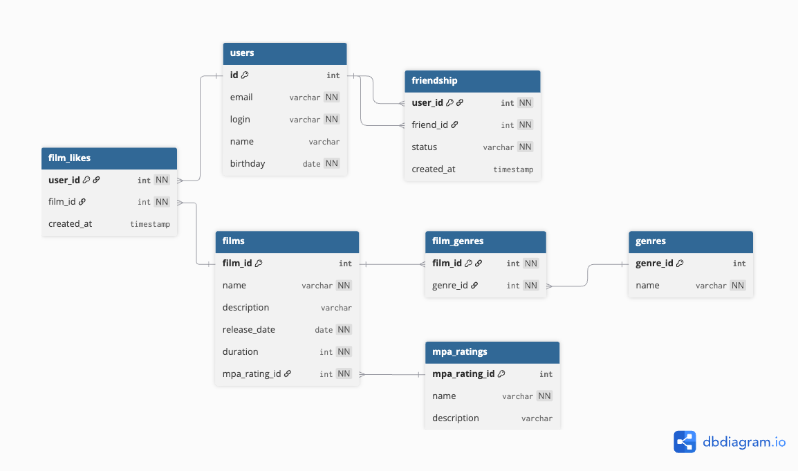

# java-filmorate
Template repository for Filmorate project.

## ER-диаграмма базы данных

[Посмотреть ER-диаграмму в dbdiagram.io](https://dbdiagram.io/d/688b1365cca18e685c98afa9)



### Описание схемы Filmorate

Схема описывает структуру базы данных для хранения информации о пользователях, фильмах, жанрах, рейтингах и связях между ними.

### Основные связи:
- Один пользователь может дружить с несколькими другими (`friendship`)
- Один пользователь может лайкать множество фильмов (`film_likes`)
- Один фильм может относиться к нескольким жанрам (`film_genres`)
- Каждый фильм имеет один рейтинг (`mpa_rating_id`)

---

## Примеры основных SQL-запросов

### Получить список всех фильмов с информацией о рейтинге MPA:
```sql
SELECT f.film_id, f.name, f.description, f.release_date, f.duration,
    m.name as mpa_rating, m.description as mpa_description
FROM films f
JOIN mpa_ratings m ON f.mpa_rating_id = m.mpa_rating_id;
```
### Получить топ-10 фильмов по количеству лайков:
```sql
SELECT f.film_id, f.name, f.description, f.release_date, f.duration,
    COUNT(fl.user_id) as likes_count
FROM films f
LEFT JOIN film_likes fl ON f.film_id = fl.film_id
GROUP BY f.film_id, f.name, f.description, f.release_date, f.duration
ORDER BY likes_count DESC
LIMIT 10;
```
